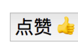

目标：一个点赞功能，并且模块化给别人用哦  
 图片：
 为了实现
 ###html
 ```angular2html
 <body>
    <div class='wrapper'>
      <button class='like-btn'>
        <span class='like-text'>点赞</span>
        <span>👍</span>
      </button>
    </div>
  </body>
```
 ###js
 ```angular2html
  const button = document.querySelector('.like-btn')
  const buttonText = button.querySelector('.like-text')
  let isLiked = false
  button.addEventListener('click', () => {
    isLiked = !isLiked
    if (isLiked) {
      buttonText.innerHTML = '取消'
    } else {
      buttonText.innerHTML = '点赞'
    }
  }, false)
```

###====>结构复用
别人是这么使用你的东西的
 new LikeButton()  
 dom====》inntrehtml===>linkbutton.render()  
```angular2html
 
  const wrapper = document.querySelector('.wrapper')
   const likeButton1 = new LikeButton()
   wrapper.innerHTML = likeButton1.render()
```

###在这基础上加上点击事件
```angular2html
 class LikeButton {
    render () {
      this.el = createDOMFromString(`
        <button class='like-button'>
          <span class='like-text'>点赞</span>
          <span>👍</span>
        </button>
      `)
      !!!!重点！！
      this.el.addEventListener('click', () => console.log('click'), false)
      return this.el
    }
  }
```
 ```angular2html
// ::String => ::Document
const createDOMFromString = (domString) => {
  const div = document.createElement('div')
  div.innerHTML = domString
  return div
}
```